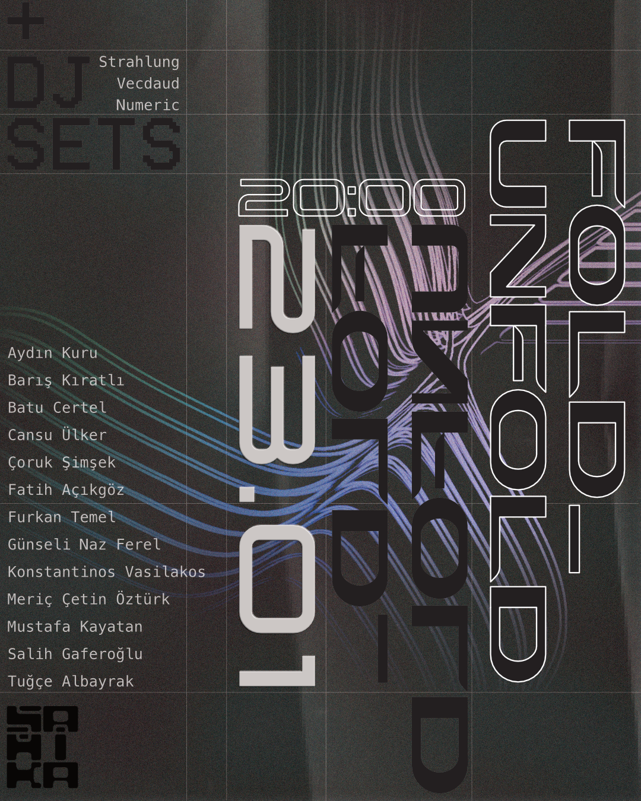

# Table of Contents

1.  [Foreword: Fold/Unfold](#org5934c23)
2.  [Listening Session](#org38ba4a9)
    1.  [Ouroboros (Albayrak)](#org85e0714)
    2.  [Expedit (Şimşek)](#org95340e3)
    3.  [Sameness (Öztürk)](#org514079b)
    4.  [foldunfold / index (Temel)](#orga5e4ebe)
    5.  [heap (Ülker)](#orgc30dba9)
    6.  [Naturize (fat)](#org657552e)
    7.  [Prep. Test (Certel)](#org8c2c44b)
    8.  [murmur (ferel)](#orge06049d)
3.  [Live Sessions](#org2f79544)
    1.  [A (Gaferoglu)](#orgbac376d)
    2.  [Live Performance (Kiratli)](#orgf64c9a2)
    3.  [Aydın Kuru](#org66c38fe)
    4.  [Live Coding (Kayatan)](#org31a11e6)
    5.  [Begin from the End (Vasilakos).](#org38ff01d)
4.  [DJ Sets](#orge75eeca)
    1.  [Vecdaud](#org20456f4)
    2.  [Strahlung](#orgf903e35)
    3.  [Numeric](#org128f245)

# Foreword: Fold/Unfold

Fold/Unfold is a kaleidoscope of sound based media, including fixed, live and experimental performances. This event is a manifestation of the ongoing dialogue of various practises under the rubric of electroacoustic music and beyond. While the works are made using diverse methodologies and various media, these all share a main idea, that is, to build an amalgama of dynamic sound based tales according to the vision of the performer/composer artist. We hope you share with us the excitement of presenting these works as we do.

# Listening Session

## Ouroboros (Albayrak)

Ouroboros is by definition “an ancient mythical serpent used to symbolise perpetuity.”
In this piece, it is aimed to see the traces of life, death and rebirth in ambisonic space with sounds. To the death of existing sounds a circle signifying the birth of non-existent sounds. Which consists of field recordings, synths and published sounds, studies were carried out on accustoming and removing an ear to a sound by using different techniques.

## Expedit (Şimşek)

Space-time is a theory claiming both concepts are always related and act together. Although time is linear and seems stable everywhere it varies at different realms. Every realm has its own perception of time.

## Sameness (Öztürk)

It&rsquo;s a perfect life, where everything looks right. But ugly truths lie beneath…
Imagine a world where people comfortable and familiar - a world where people
wake up the same day and get more and more dark and monotonous.
This work, is a point of view to the people who lives in industrialised city full of rusty
metals and blocks of cold concrete in a mechanised world. In the process I tried to create a unique piece using different kinds of production techniques and field recordings. I worked on different  distortions and saturation effects to make a crispy industrial sound. With the diffusion effect, I Created infinite reverb release and decay effects. I combined field recordings like animal or industrial noises with various effects to reach that windy city  ambience sound that I collected from field recording sound banks.

## foldunfold / index (Temel)

The raw material for the piece was culled from a personal archive of various field recordings and synthesised sounds, produced through generative manipulation of several hardware and software synthesisers and synthesising algorithms. The field recordings were run through spectral manipulation processes until they vaguely resemble the source file. The selection was edited with attention to the degree of change between elements, dramatic or subtle, and the arrangement meanders through higher and lower levels of micro and macro organisation. The panoramic image of the mix and the relationship of positive and negative spaces in the music were foremost in my mind. The piece is called foldunfold/index because most of the sound files I utilised in the composition were left unlabeled after a hard-drive error, so it is my attempt at making sense of sounds produced over a period of several months. Equalised through this gesture of unintentional data wipeout, the sounds find new life and meaning in unforeseen connections and juxtapositions.

## heap (Ülker)

In terms of computer science, a memory heap is a location in memory where dynamically allocated memory resides during run time. Unlike the stack where memory is allocated and released in a very defined order, individual data elements allocated on the heap are typically released in ways which are asynchronous from one another.
All music consists of different layers, different data elements that vary in time, pitch and timbre parameters which exist together and finally release to create the final form. This piece is no exception. Consisting of granulated, pitch manipulated one shot recordings and generative sounds; the layers form a somewhat ordered, linear sequence of items without any former intentions or objectives besides pleasure. At the end of the piece the heap memory will be freed up with the hope that it will stay with you a bit longer.

## Naturize (fat)

Take a look at the Ring Ouzel intensifies that something is starting to go out of existence.
Where is the snow? The steps flowing over are evaluating…
The unknowns of nature derive unknowns from unknowns.
Ear on the call of Morus Capensis…
Their calls are divided into smallest particles.
They are leaving…
The dominance of the sounds produced by the unknowns is rising.
Is that a new beginning?
In the deep end of Ouzel&rsquo;s voice, you may feel this pressure and certainty.
They are transforming…
I am not sure that they are evolving…
They don&rsquo;t hear themselves anymore.
They stand on a translucent surface between existence and absence.
They are already gone.
Where are they?
Is it possible to recall everything?

## Prep. Test (Certel)

The piece is all about summarizing my preparation class’ lecture notes and creating a composition as its outcome. Working on this piece has been edifying from the beginning. Instrumental pieces’ narrative path mostly depends on the listener at the end of the day, and fictive forms have a lot to do with the listener’s inner world unless there are necessary elements to follow. For me, It has been about enjoying both the sound and time but not ascribing meanings to the composition. As a piece of humble information, with an artistic approach, It is achievable to create a physically unexisting world of sounds, built of abnormal scapes, unnatural noises, and settings beyond physics. With the freedom that comes naturally with the artistic approach, there likely are many possibilities of organizing sounds in unrealistic ways.

## murmur (ferel)

With the guidance of all the materials of our prep year, murmur is mainly about shaping human voices and their meanings, grammars, gasps, spaces they exist within. it’s simply a discovery of sound manipulation, taking humans voice as its material. it’s a seed, hopefully.

# Live Sessions

## A (Gaferoglu)

Radiomorph is a digital processing interface that aims to discover possibilities between granular sound synthesis & gestural interaction. In granular synthesis, the outcoming result is highly dependent on the type of source. Radiomorph aims to allow its performer to capture real-time FM broadcast radio signals, and interact with these signals with the help of a meticulously designed granular synth inside the audio programming language SuperCollider (SC). In order to be able to capture hand gestures and make use of them in sound-sculpting operations in SC via mapping, there is an implementation of Leap Motion (LM) as a controller interface. The system is designed to convert hand gestures that are captured by LM to OSC (Open Sound Control) signals. To establish this conversion as precisely as possible, a TouchDesigner (TD) patch was designed and a connection between SC & TD was established via OSC protocol.

## Live Performance (Kiratli)

A live performance using gestural controllers input for real time improvisation.

## Aydın Kuru

Live coding and mapping performance by Aydın Kuru exploring additive synthesis with geometrical series.

## Live Coding (Kayatan)

A live coding performane using TidalCycles.

## Begin from the End (Vasilakos).

Live coding is the act of inventing one&rsquo;s tools, material and other sounding paraphernalia on stage, but also finding workarounds on limitations that arise during the “creation” of the music at hand. While the performer is free, no specific rules nor structure or musical paradigm must be followed, but also a way to explore and develop sonic paths. Sometimes ideas pop up by a simple nod or a spontaneous sound in the audience; these in situ musical paraphernalia and sonic regalia all come into play, having a direct impact on improvisation. Live coding heralds a fertile solution and poses some interesting challenges for exploring live performance of live electronics *par excellence*. It also enacts the collective exploration rather than individually in an offline process detached from the moment of the performance. But is this musically meaningful, one may ask. Instead of attempting to provide a solemn statement on this question. I shall reflect with the following quotation: &ldquo;We shall not cease from exploration And the end of all our exploring Will be to arrive where we started And know the place for the first Time.&rdquo; [T.S. Eliot, from “Little Gidding,” Four Quartets (Gardners Books; Main edition, April 30, 2001)
Originally published 1943)]

# DJ Sets

## Vecdaud

## Strahlung

## Numeric

